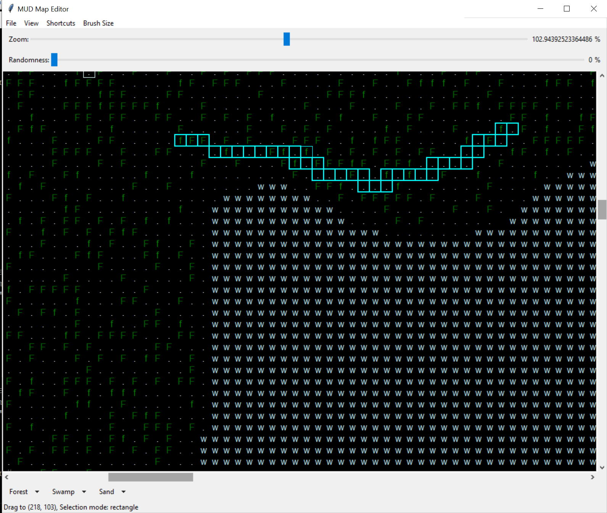
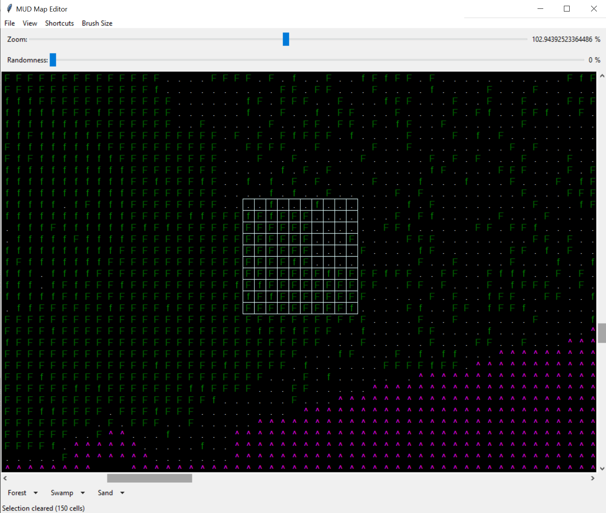
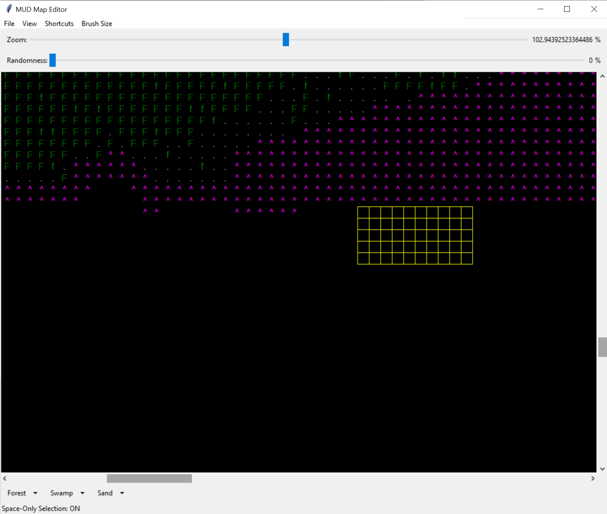

# Text Map Painter

**Text Map Painter** is a lightweight editor for creating and modifying text-based (ASCII) maps.  
Originally authored for [Beyond the Void MUD](https://www.voidmud.com), it is designed to be general-purpose and can be used for **any text game, roguelike, or ASCII project**.

With Text Map Painter, you can quickly select, paint, and reshape maps in a way that feels natural — as if you’re painting on a canvas, but with text.

---

## Features

- 🖌️ **Free selection** — drag across a region to select a swath of cells, then paint them all at once.  
  

- 🎨 **Brush sizes** — paint with different brush sizes to cover large areas quickly or make fine details.  
  

- ⬜ **Space Selection mode** — select only empty (space) cells, leaving existing non-space characters untouched.  
  

- ⌨️ **Type-to-paint** — once cells are selected, you can paint them with **any character** just by typing it.

- 🌲 **Biome presets** — use pre-defined paint types at the bottom of the UI for forests, swamps, and sand biomes.

---

## Getting Started

Clone the repository:
```bash
git clone https://github.com/wedsall/Text-Map-Painter.git
cd Text-Map-Painter
python map_editor.py

This code does not create the initial blank map. Use a pre-created map. Make sure each row is exactly the same length for best results.

